# Hi there! 👋

I am a second-semester Computer Science undergraduate building a foundation in **Data Analysis**, **Python**, and **Databases**. I am currently focusing on extracting insights from data and expanding my analytical toolkit through professional coursework.

* 🔭 **Currently working on:** Data Science, Python coursework, and Training Models.
* 🌱 **Currently learning:** Advanced SQL, Jupyter workflows, and completing the IBM Data Science and Microsoft Python tracks on Coursera.
* ⚡ **Fun fact:** I listen to cinematic action movie scores while coding to keep the momentum up.

### 🛠️ Languages & Databases

### 📊 Data Analysis & Visualization

### 📓 Tools & Environments

### 📈 GitHub Analytics

  
  

